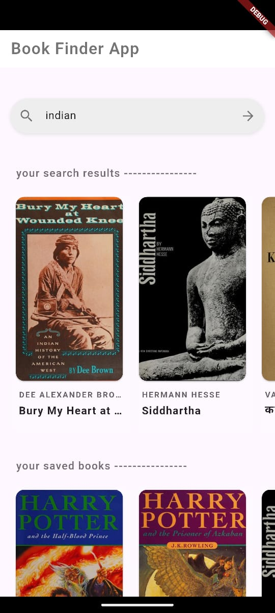
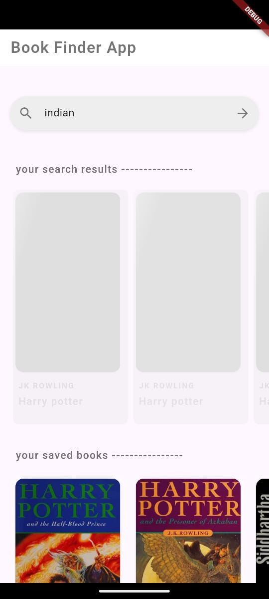
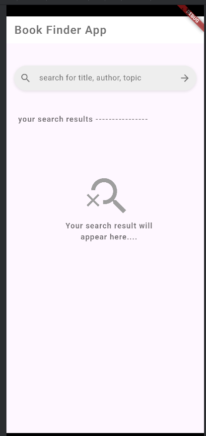

# 📚 Book Finder

**Book Finder** is a Flutter application that allows users to search for books by title, view detailed information, and store selected books locally. It is built using **Clean Architecture**, **Provider** for state management, and **GetIt** for dependency injection. The app also supports **pagination**, **rotating cover animation**, and **local storage using SQLite**.

---

## ✨ Features

- 🔍 Search for books using the [Open Library API](https://openlibrary.org/developers/api)
- 📖 View book details including cover, title, and author
- 📄 Paginated results for seamless scrolling
- 🔄 Pull-to-refresh to reload results
- 💿 Save books locally using `sqflite`
- 🌀 Animated rotating book covers
- ⚡ Shimmer loading effect while fetching data

---

## 🧱 Architecture

This app follows the **Clean Architecture** design pattern, promoting scalability, testability, and separation of concerns. The project is organized into layers:

```
lib/
├── core/           # Core utilities and base classes
├── data/           # Data models, mappers, remote/local data sources
├── domain/         # Entities and use cases
├── presentation/   # UI layer: widgets, screens, providers
└── di/             # Dependency injection setup with GetIt
```

---

## 🧩 Tech Stack

| Layer         | Responsibility                          | Technology Used          |
|--------------|-------------------------------------------|---------------------------|
| UI           | User Interface & interactions             | Flutter, Provider         |
| Domain       | Business logic and rules                  | Plain Dart                |
| Data         | API & Local DB access                     | Dio, Sqflite, OpenLibrary |
| Core         | Common utilities, models, error handling  | Dart                      |
| DI           | Dependency injection                      | GetIt                     |

---

## 🗂️ State Management

The app uses [`Provider`](https://pub.dev/packages/provider) for scalable state management. Each feature module has its own `ChangeNotifier` or `ViewModel` that manages state and UI communication.

---

## 🧪 Dependency Injection

The app uses [`get_it`](https://pub.dev/packages/get_it) as a **Service Locator**. All dependencies (use cases, repositories, data sources) are registered in `di/injector.dart`.

```dart
void main() async {
  WidgetsFlutterBinding.ensureInitialized();
  await setupLocator();
  runApp(const MyApp());
}
```

---

## 📦 Local Storage

Saved books are stored using [`sqflite`](https://pub.dev/packages/sqflite), allowing offline access and persistent local storage. Users can revisit saved books even without internet.

---

## 🔁 Pagination

The book search results are **paginated**, ensuring efficient loading and memory management for long search lists.

---

## 🌀 Book Cover Animation

Book cover images in the details screen are enhanced with a **rotation animation**, giving a subtle and interactive feel to the UI.

---

## ✅ Unit Testing

The project includes **unit tests for Remote Data Sources** to ensure reliable API communication. Tests mock external API responses using packages like `mockito` for test isolation.

```
test/
├── data/
│   └── remote/
│       └── book_remote_data_source_test.dart
```

Run tests with:

```bash
flutter test
```

---

## 🚀 Getting Started

### Prerequisites

- Flutter SDK (v3.0+ recommended)
- Android Studio / VS Code

### Setup & Run

```bash
git clone https://github.com/your-username/book_finder.git
cd book_finder
flutter pub get
flutter run
```

---

## 📸 Screenshots

### 🔍 Book Search UI


### 📖 Book Details UI


### ✨ Shimmer Loading Animation


### ❌ Empty State



| Search Screen                            | Book Details Screen                        |
|------------------------------------------|--------------------------------------------|
|  |    |

---

## 📄 License

This project is licensed under the MIT License - see the [LICENSE](LICENSE) file for details.

---

## 🙌 Acknowledgements

- [Open Library API](https://openlibrary.org/developers/api)
- Flutter & Dart Community
